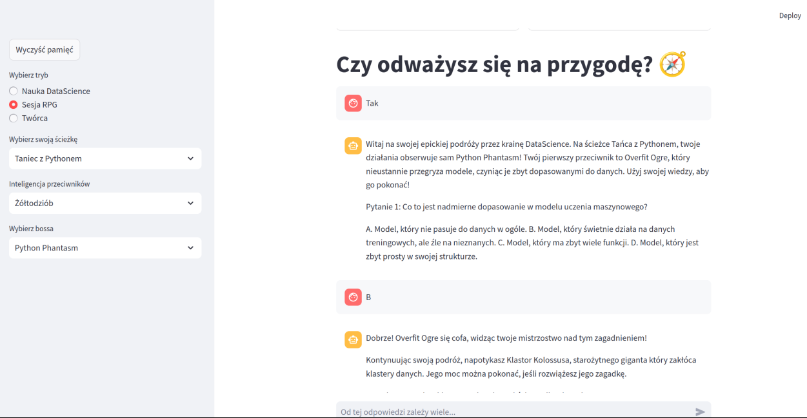

<!DOCTYPE html>
<html lang="en">
<head>
    <meta charset="UTF-8">
    <meta name="viewport" content="width=device-width, initial-scale=1.0">
    <title>AI Data Science Learning App</title>
    
</head>
<body>

    <h1 class="title">Data4Play 💻</h1>

    <section class="section">
        
This application support you with teachnig data science with AI.
        My app offers three modes to learn: Normal, Game and Creator Mode. 
        This app offers: Interactive Chats, Engaging Challenges and Learning Paths.
        I have learnt thanks to this:

        

    </section>
        <ul>
            <li>Python</li>
            <li>Streamlit</li>
            <li>Using AI Model</li>
        </ul>
    </section>
<a href="https://github.com/krzysztofkleszcz50/data_playground3.git">Please see my github link here</a>. 
    
 
         
    

</body>
</html>
