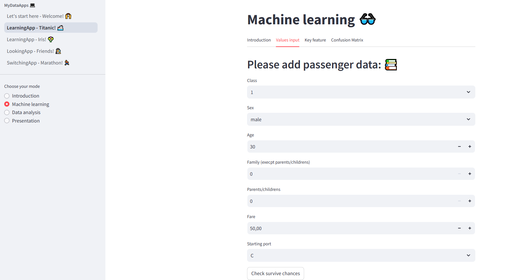

<!DOCTYPE html>
<html lang="en">
<head>
    <meta charset="UTF-8">
    <meta name="viewport" content="width=device-width, initial-scale=1.0">
    <title>Friendship App</title>
    
</head>
<body>

    <h1 class="title">Data4Apps 🕵️‍♀️</h1>

    <section class="section">
        
This application show you interactive analysis.
        My app offers four interactive data analysis of four datasets: Titanic, Company, Survey and Marathon.
        I have learnt thanks to this:
        

    </section>
        <ul>
            <li>Python (functions, logics, streamlit)</li>
            <li>Data processing (pandas, matplotlib, seaborn)</li>
            <li>Machine Learning (Pycaret, classification)</li>
            <li>Deploying</li>
        </ul>
    </section>
<a href="https://data4play.streamlit.app/">Please see my app link here</a>. 
 

<a href="https://github.com/krzysztofkleszcz50/Data4Play">Please see my git link here</a>. 
    
 
         
    

</body>
</html>
