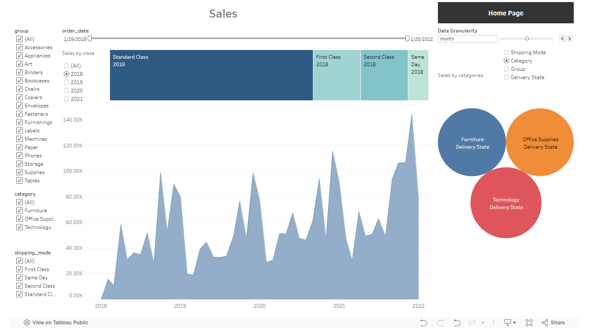

<!DOCTYPE html>
<html lang="en">
<head>
    <meta charset="UTF-8">
    <meta name="viewport" content="width=device-width, initial-scale=1.0">
    <title>Tableau Project</title>
    
</head>
<body>

    <h1 class="title">Mini Projects ✨</h1>
    <h2 class="title">Tablo 🔎</h2>

    <section class="section">
        
Welcome to my Tableau project where data comes to life through interactive visualizations. This Tableau project offers in-depth analysis and visualization of sales data. Explore the following features to enhance your understanding of the data Interactive Dashboards and Data Filters. 
        Please see the project on Tableau Public <a href="https://public.tableau.com/app/profile/krzysztof.kleszcz/viz/SalesSuperstore_17308345887650/SalesDetails">here</a>. 
        

    </section>
    
 
        
    

    <h2 class="title">Python miniprojects 💎</h2>

    <section class="section">
        
Please see 4 MiniApps in this folder. Apps:

            
Data4Iris - Iris EDA analyse with MLL as an app! 💐

            
Data4Create - Create your own ChatApp with AI! 💎

            
Data4Predict (Beta) - Create your own MLL model! 📳

            
Data4Catch - Catch your invoice to numbers 📝 

            Please see code of projects on github <a href="https://github.com/krzysztofkleszcz50/mini_projects">here</a>. 
        

    </section>

    
    

</body>
</html>
